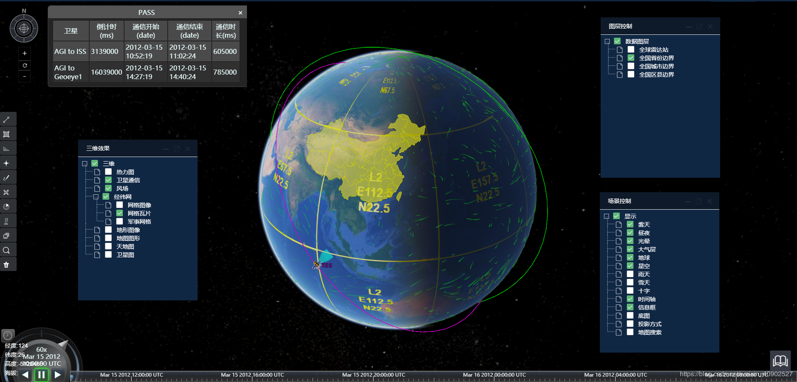
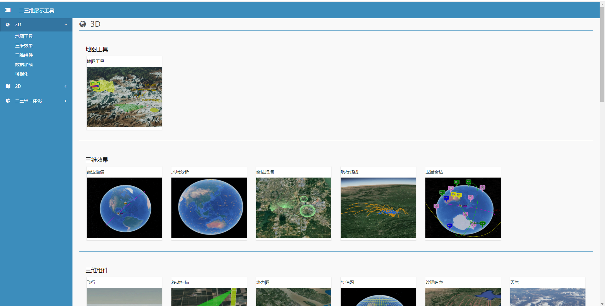
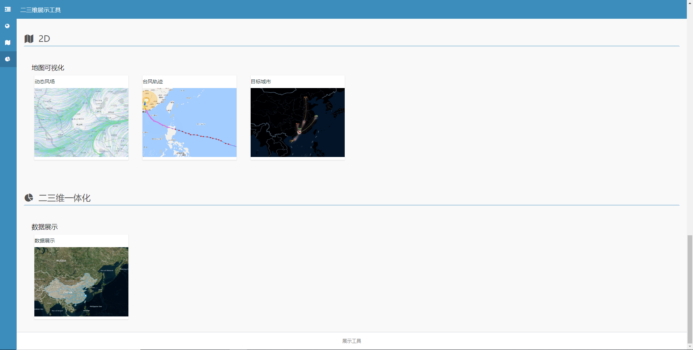
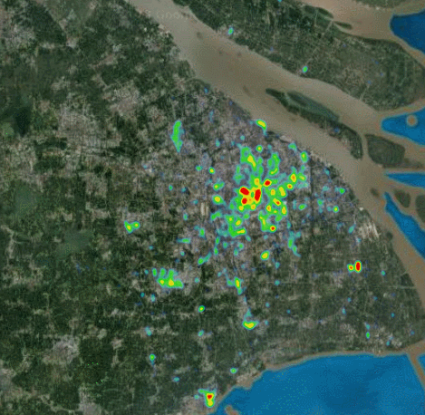
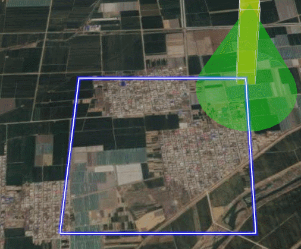
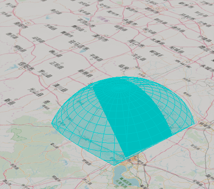
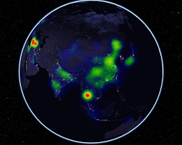

# cesium---tool

cesium 三维可视化系统 

运行项目需要data目录 
存放位置 ： ../common/3d/data 
由于数据量较大,压缩上传至csdn:  https://download.csdn.net/download/weixin_40902527/11629130 
请自行下载 

 

cesium 整合的三维效果 

1.轨迹回放  
2.三维效果 
3.图层 
4.模型 
5.图标 
6.绘图,量测工具,标绘 

支持动态修改配置 
<a href="https://blog.csdn.net/weixin_40902527/article/details/97137898"> 
<a href="https://blog.csdn.net/weixin_40902527/article/details/97137898"> 
&nbsp;
&nbsp;
&nbsp;
&nbsp;
&nbsp;
&nbsp;
&nbsp;
&nbsp;
&nbsp;
&nbsp;
&nbsp;
&nbsp;
&nbsp;