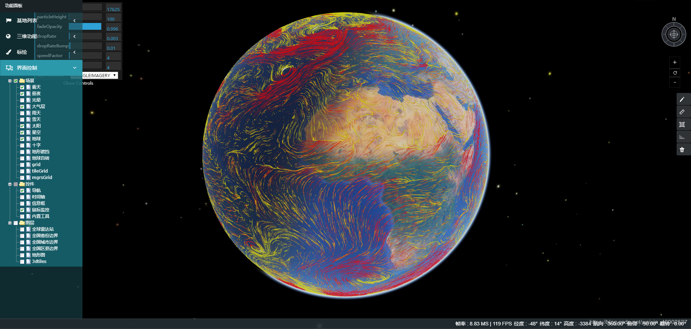
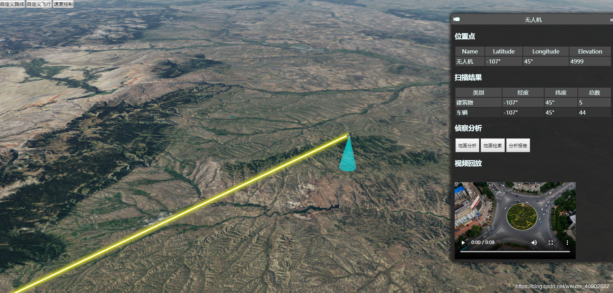
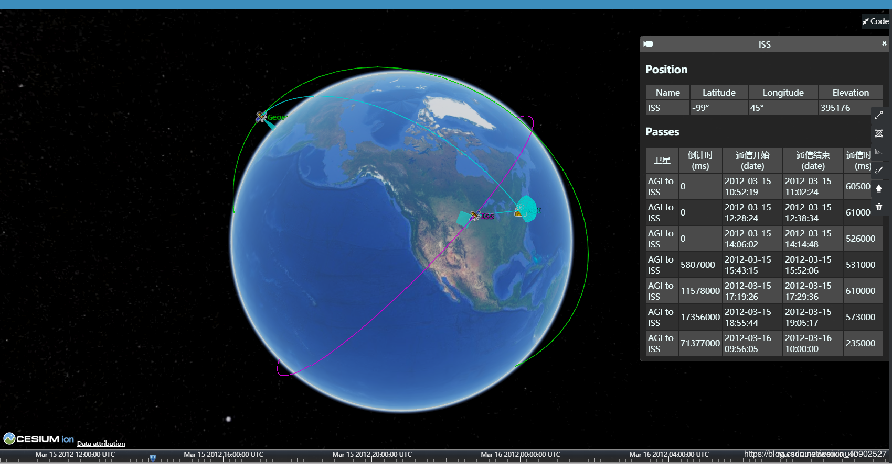
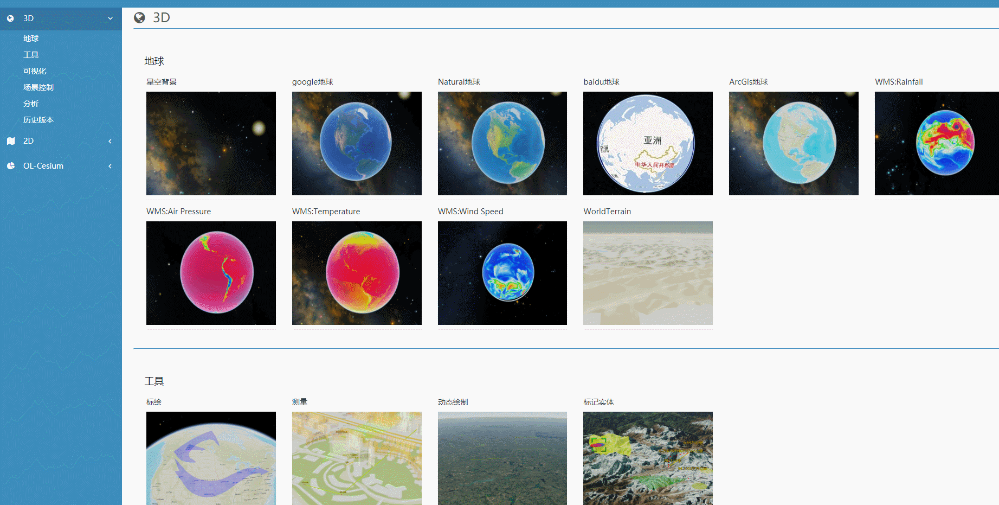
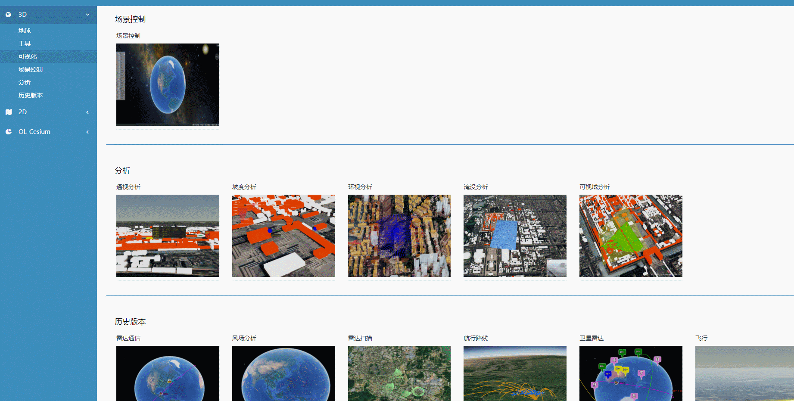
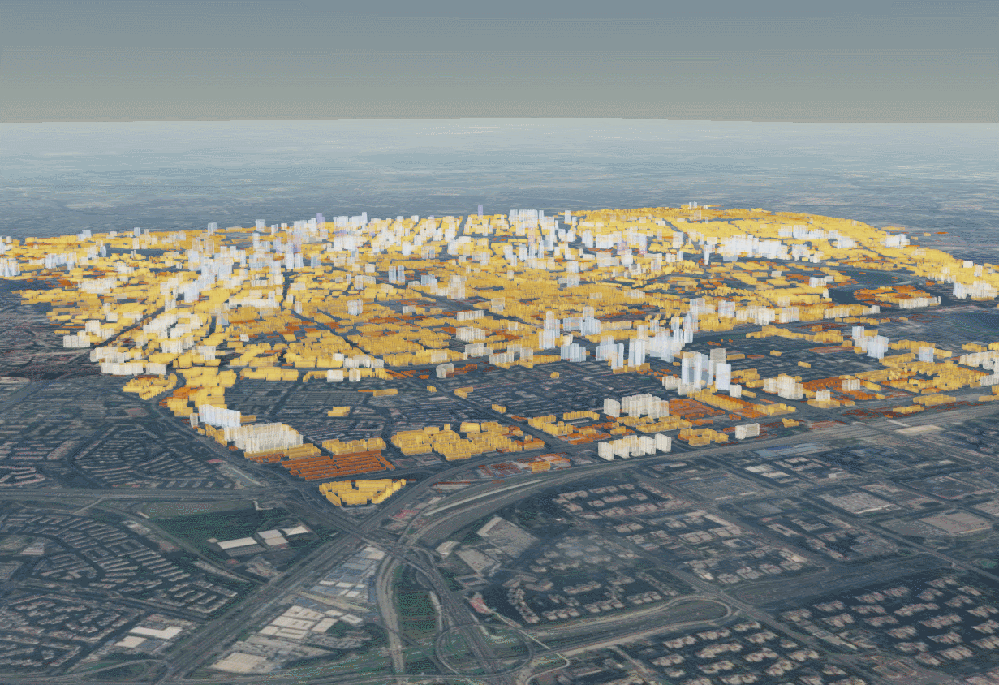
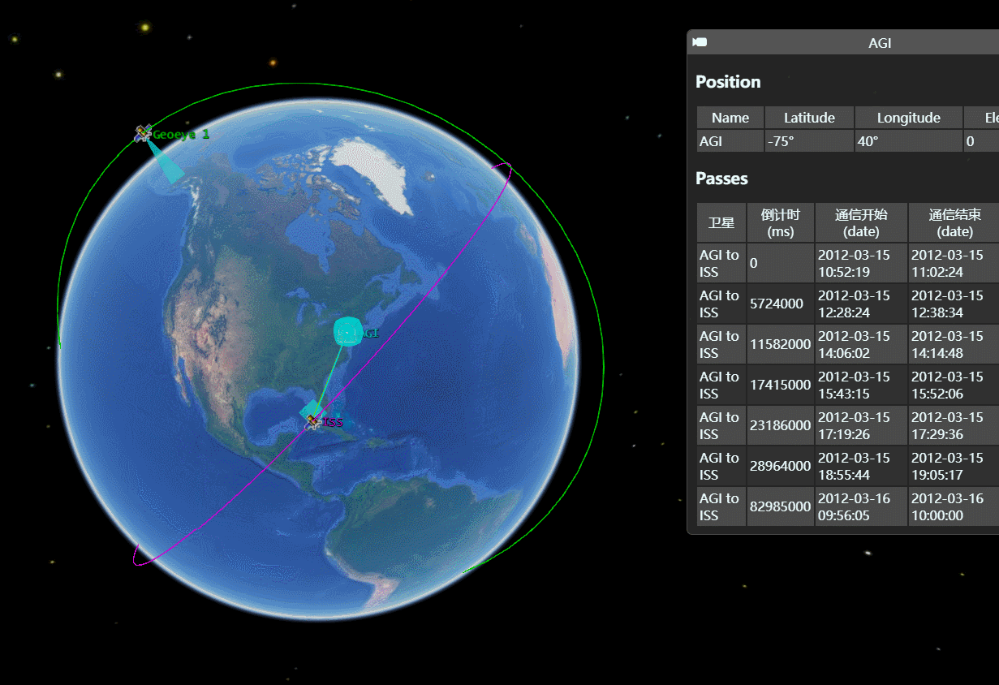
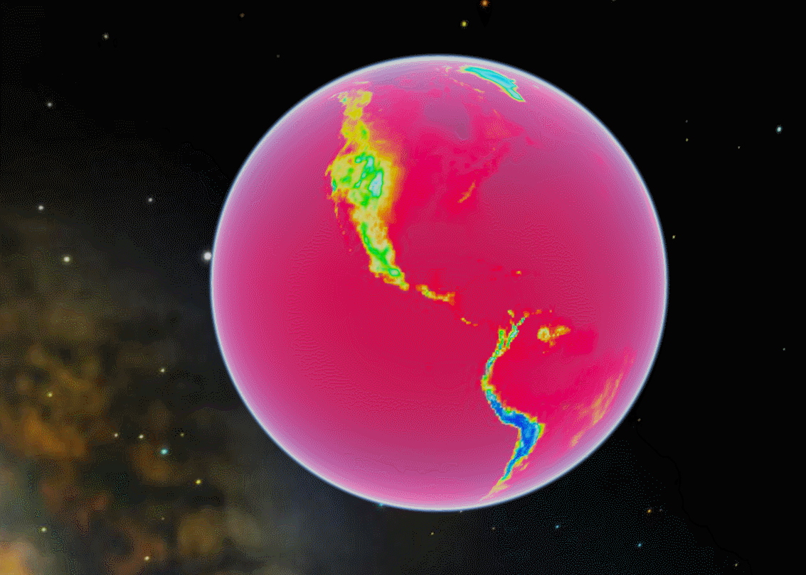
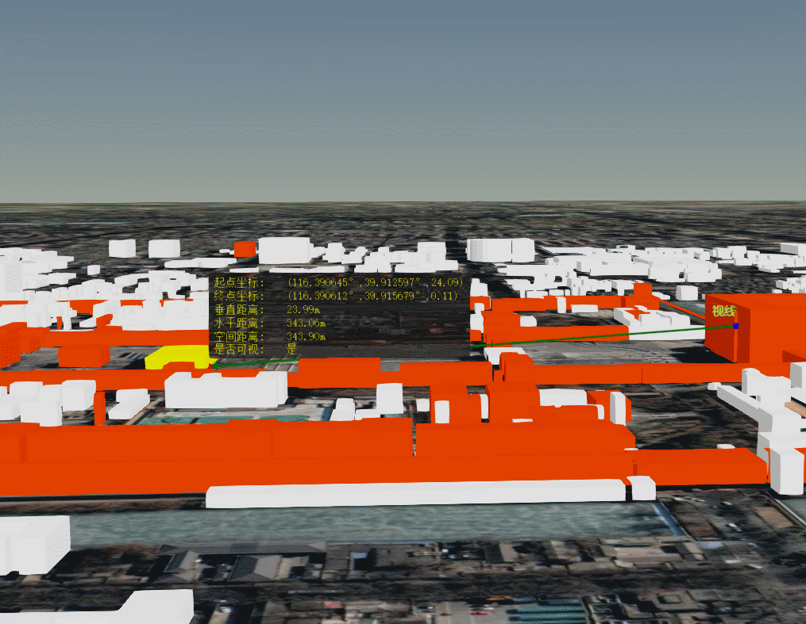

<!--
 * @Descripttion: 
 * @version: 1.0
 * @Author: zhangti
 * @Date: 2019-08-27 18:29:55
 * @LastEditors: sueRimn
 * @LastEditTime: 2019-11-21 15:41:15
 -->
# cesium-example

 -- cesium 整合的三维效果 
 
 
 

&nbsp;
&nbsp;
&nbsp;
1.轨迹回放  
2.三维效果 
3.图层 
4.模型 
5.图标 
6.绘图,量测工具,标绘 
.....

&nbsp;
&nbsp;
&nbsp;
&nbsp;
&nbsp;
&nbsp;
&nbsp;
&nbsp;
&nbsp;
&nbsp;
&nbsp;
